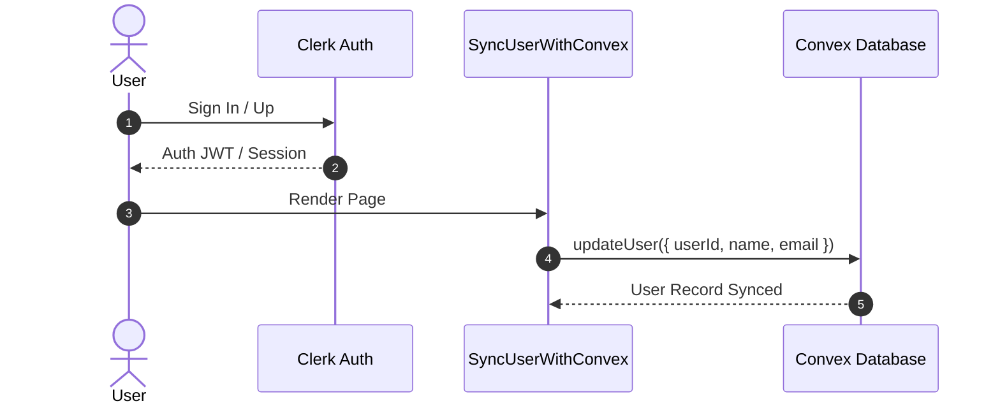
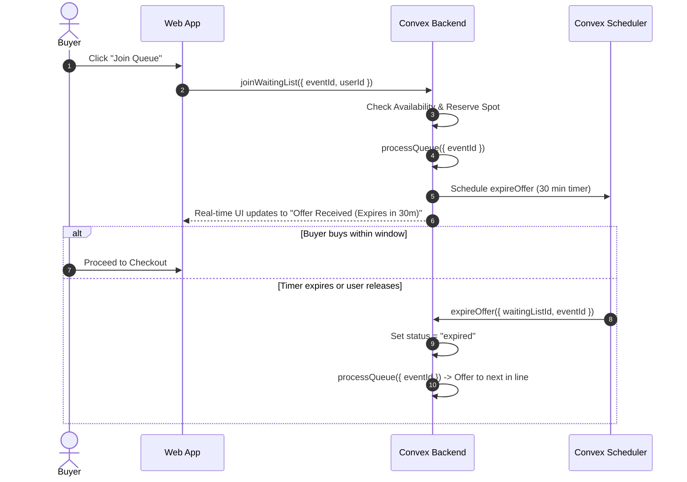
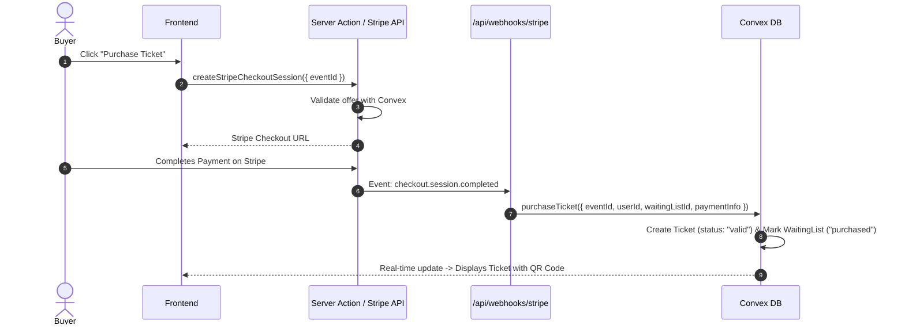
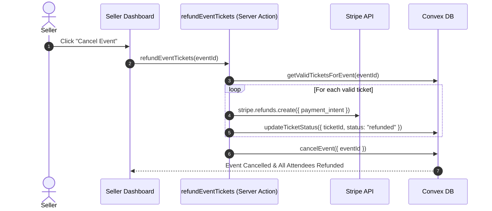

# 🎟️ Eventra - Real-Time Event Ticketing & Queue Platform

**Ticketr** is a full-stack, real-time event ticketing and queue management platform built with Next.js 15, Convex, Clerk Authentication, and Stripe Connect. It features a fair waiting-list queue system with time-limited ticket offers, instant user sync, automated background task scheduling, seller payout routing, and automated event refunds.

---

## 🛠️ Technology Stack

| Layer | Technology |
| :--- | :--- |
| **Framework** | Next.js 15 (App Router, Turbopack, Server Actions) |
| **Language** | TypeScript |
| **Frontend UI** | React 19, Tailwind CSS v4, Radix UI, Lucide Icons, Sonner |
| **Database & Realtime** | Convex (Reactive queries, mutations, file storage, scheduled background tasks) |
| **Authentication** | Clerk (`@clerk/nextjs` with custom sync to Convex database) |
| **Payments & Payouts** | Stripe Connect Express & Custom (Checkout sessions, webhooks, seller payouts, refunds) |
| **Ticketing & Passes** | QR Code Generation (`react-qr-code`) |

---

## 🏗️ High-Level System Architecture

The application follows a modern serverless architecture where Next.js handles server rendering, server actions, and API webhooks, while Convex acts as the real-time database and task scheduler backend.

    Client["💻 Client (React 19 / Next.js)"]
    Clerk["🔐 Clerk Auth"]
    NextServer["⚡ Next.js Server Actions & Webhooks"]
    ConvexDB["⚡ Convex DB (Real-time DB & File Storage)"]
    ConvexScheduler["⏱️ Convex Scheduler (Background Jobs)"]
    Stripe["💳 Stripe API & Stripe Connect"]

    Client -->|Authenticates| Clerk
    Client -->|Real-time Subscriptions & Mutations| ConvexDB
    Client -->|Triggers Server Actions| NextServer
    NextServer -->|Creates Checkout Sessions & Payout Links| Stripe
    Stripe -->|Sends Webhook Events (checkout.completed)| NextServer
    NextServer -->|Mutates State (purchaseTicket)| ConvexDB
    ConvexDB -->|Schedules Expirations| ConvexScheduler
    ConvexScheduler -->|Triggers Expiration & Queue Reprocessing| ConvexDB


## 🔄 Core Application Flows & Architecture

### 1. User Authentication & Synchronization Flow
- User signs in or registers via **Clerk**.
- The `SyncUserWithConvex` component checks authentication state on page load.
- If logged in, it invokes the Convex mutation `api.users.updateUser` to ensure user record consistency in the `users` table.



---

### 2. Waiting List & Queue Management Flow (Fair Ticket Offer System)
To prevent ticket scalping and bots, tickets are distributed sequentially through a time-limited waiting list:
1. **Join Queue**: User requests to join an event waiting list. Convex checks ticket availability and inserts a record into `waitingList` with `status: "waiting"`.
2. **Queue Processing**: If spots are available, `processQueue` picks eligible users in chronological order, sets `status: "offered"`, and calculates an expiration timestamp (`offerExpiresAt` = Now + 30 minutes).
3. **Automated Scheduler**: Convex schedules a background job (`internal.waitingList.expireOffer`) via `ctx.scheduler.runAfter(DURATIONS.TICKET_OFFER, ...)`.
4. **Offer Expiration / Release**:
   - If the user purchases within 30 minutes, the ticket is minted and `waitingList` status becomes `purchased`.
   - If the 30-minute window expires or the user clicks **Release Ticket**, status changes to `expired`, and `processQueue` is triggered immediately for the next user in line.



---

### 3. Stripe Connect Onboarding & Checkout Flow
- **Seller Setup**: Event organizers connect their Stripe Account using `createStripeAccountLink`. Payments for their events flow directly to their connected Stripe account while deducting a platform processing fee (1%).
- **Checkout Session**: When a buyer has an active offer, clicking "Buy Ticket" invokes server action `createStripeCheckoutSession`. It sets metadata (`eventId`, `userId`, `waitingListId`) and sets `expires_at` to match the offer window.
- **Webhook Processing**:
  - Stripe sends `checkout.session.completed` to `/api/webhooks/stripe`.
  - Webhook verifies signature and calls Convex `purchaseTicket` mutation.
  - Ticket is created (`tickets` table) with status `"valid"` and payment intent metadata.



---

### 4. Event Cancellation & Automated Attendee Refunds
- Organizer chooses to cancel an event from the Seller Dashboard.
- `refundEventTickets(eventId)` server action fetches all valid tickets for the event.
- It iterates through all attendees, issuing refunds through the **Stripe Refunds API** against the organizer's connected Stripe account.
- Upon successful refund processing, ticket statuses update to `"refunded"`, and the event is marked as `is_cancelled: true`.



---

## 🗄️ Database Schema (`convex/schema.ts`)

```typescript
// Core Data Models
events: {
  name: string,
  description: string,
  location: string,
  eventDate: number,
  price: number,
  totalTickets: number,
  userId: string, // Organizer Clerk User ID
  imageStorageId?: Id<"_storage">,
  is_cancelled?: boolean
}

tickets: {
  eventId: Id<"events">,
  userId: string,
  purchasedAt: number,
  status: "valid" | "used" | "refunded" | "cancelled",
  paymentIntentId?: string,
  amount?: number
} // Indexes: by_event, by_user, by_user_event, by_payment_intent

waitingList: {
  eventId: Id<"events">,
  userId: string,
  status: "waiting" | "offered" | "purchased" | "expired",
  offerExpiresAt?: number
} // Indexes: by_event_status, by_user_event, by_user

users: {
  name: string,
  email: string,
  userId: string, // Clerk User ID
  stripeConnectId?: string
} // Indexes: by_user_id, by_email
```

---

## 📁 Directory & Project Structure

```text
├── actions/                         # Next.js Server Actions (Stripe & Refunds)
│   ├── CreateStripeAccountLink.ts   # Onboards sellers via Stripe Connect
│   ├── CreateStripeCheckoutSession.ts # Initiates buyer checkout session
│   ├── CreateStripeCustomer.ts      # Creates Stripe customer entity
│   ├── getStripeAccountStatus.ts    # Checks seller onboarding completion
│   └── refundEventTIckets.ts        # Processes batch refunds on event cancellation
├── app/                             # Next.js App Router Pages & API Routes
│   ├── api/webhooks/stripe/         # Stripe checkout webhook handler
│   ├── connect/                     # Stripe Connect return/refresh endpoints
│   ├── event/[id]/                  # Event detail & ticket purchase page
│   ├── seller/                      # Organizer dashboard & event management
│   ├── tickets/                     # User purchased tickets & QR code viewer
│   ├── search/                      # Event search & discovery
│   ├── layout.tsx                   # Root layout with Convex & Clerk providers
│   └── page.tsx                     # Marketplace homepage listing events
├── components/                      # UI Components
│   ├── EventCard.tsx                # Event item preview card
│   ├── EventForm.tsx                # New event creation form with image upload
│   ├── JoinQueue.tsx                # Real-time queue button & position tracker
│   ├── PurchaseTicket.tsx           # Ticket offer countdown & checkout trigger
│   ├── ReleaseTicket.tsx            # Manual offer release button
│   ├── SellerDashboard.tsx          # Metrics & event management interface
│   ├── SyncUserWithConvex.tsx       # Auth sync component between Clerk & Convex
│   └── Ticket.tsx                   # Digital ticket rendering with QR code
├── convex/                          # Convex Backend Functions & Schema
│   ├── schema.ts                    # Database table definitions & indexes
│   ├── events.ts                    # Event queries, mutations & ticket purchase
│   ├── waitingList.ts               # Queue logic, processQueue & scheduled expiry
│   ├── tickets.ts                   # Ticket status management & lookup queries
│   ├── storage.ts                   # Storage URLs for banner images
│   └── users.ts                     # User profile lookup & update mutations
├── lib/                             # Shared Helper Libraries (Convex, Stripe)
└── middleware.ts                    # Clerk authentication middleware route protection
```

---

## 🚀 Getting Started

### 1. Prerequisites
- **Node.js**: v18+
- **Convex Account**: [convex.dev](https://convex.dev)
- **Clerk Account**: [clerk.com](https://clerk.com)
- **Stripe Account**: [stripe.com](https://stripe.com)

### 2. Environment Setup
Create a `.env.local` file in the root directory:

```env
NEXT_PUBLIC_CONVEX_URL=https://your-convex-deployment.convex.cloud
NEXT_PUBLIC_CLERK_PUBLISHABLE_KEY=pk_test_...
CLERK_SECRET_KEY=sk_test_...

STRIPE_SECRET_KEY=sk_test_...
STRIPE_WEBHOOK_SECRET=whsec_...
NEXT_PUBLIC_BASE_URL=http://localhost:3000
```

### 3. Installation & Local Development

```bash
# Install dependencies
npm install

# Start Convex dev backend (in a separate terminal)
npx convex dev

# Optional: Seed sample data
npx convex import --table events convex/sampleData.json

# Run Next.js local development server
npm run dev
```

Open [http://localhost:3000](http://localhost:3000) in your browser.

